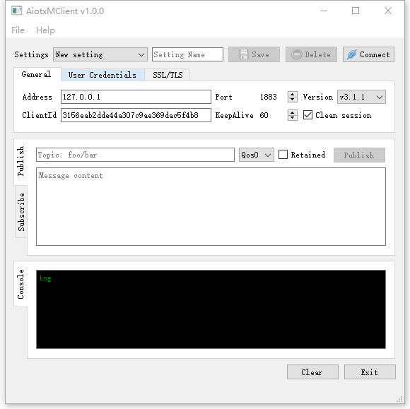

# Mqtt-client

Mqtt client made by c++ and QT official mqtt library

The mqtt client library that this program relies on is the newly added module in official version 5.11 of QT, and the corresponding QT version is required to modify or compile code.

# Todo

* Will message
* SSL/TLS Support
* Some timeout judgments, such as Connecting / publishing ...
* Reconnection mechanism
* Multilingual support
* Timed publish
* Multiple thread publish(Pressure testing)

# License

GNU General Public License v3.0